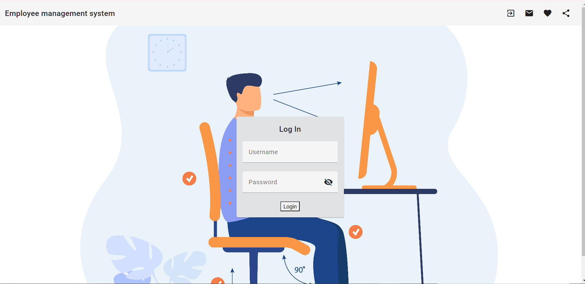
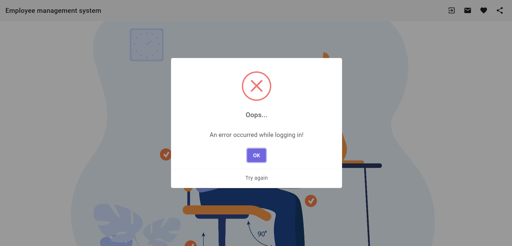
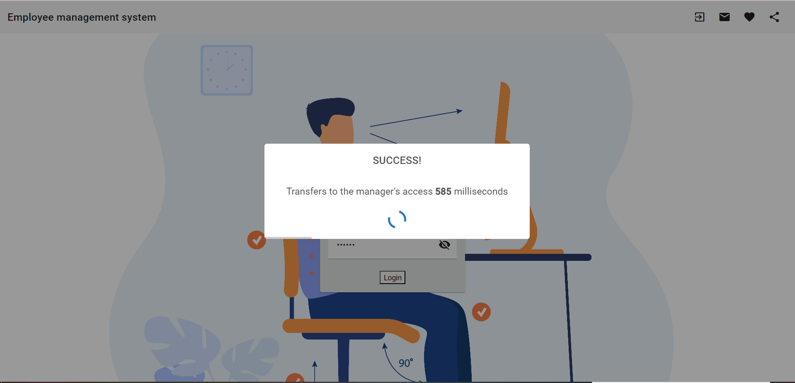
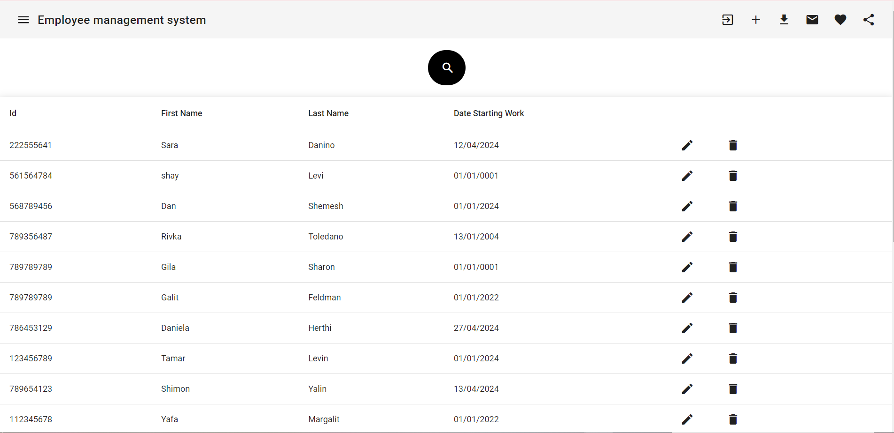
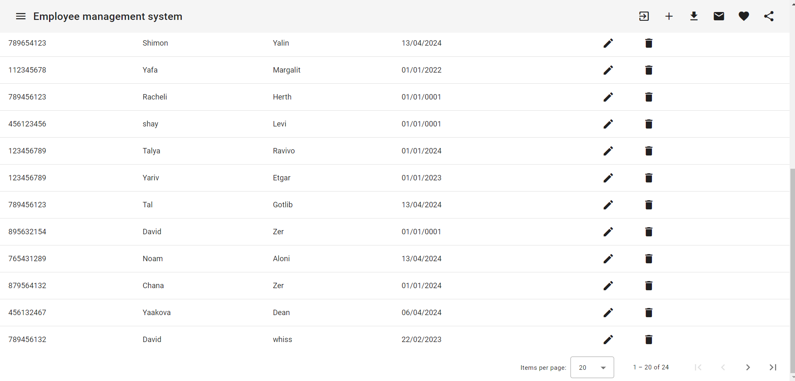
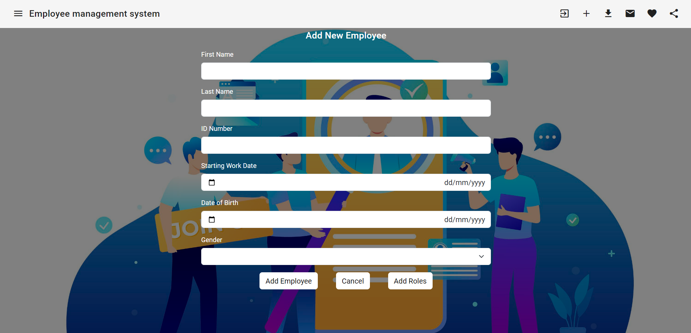
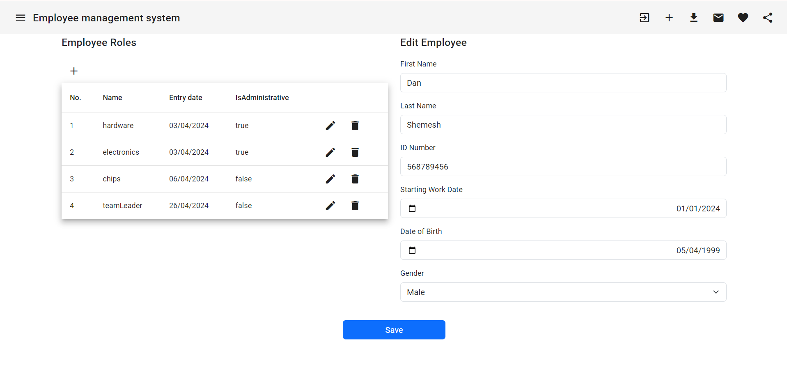
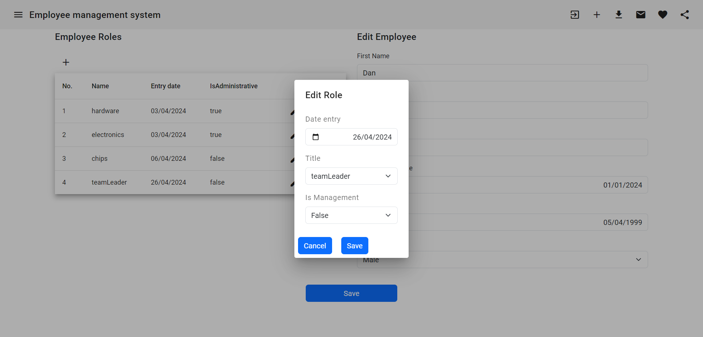
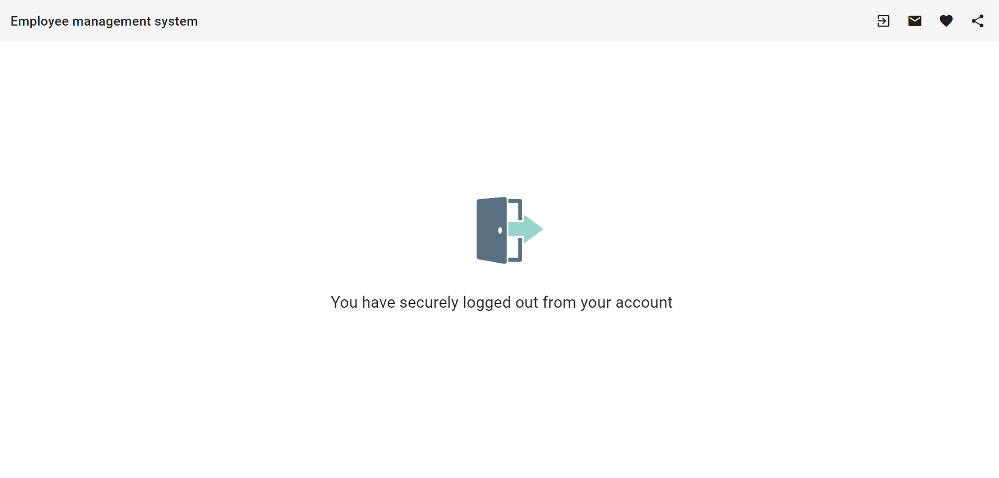

## Welcome to the employee management system - the perfect solution for every business manager

### How to use:
Download the project,

Now you will see that you have a server side and a client side.

Open the server side in VS,

Don't forget to install the database on your computer before running-

This is how you write in the terminal:

`Add-Migration <migration name>`

`update-database`

The DB has been updated!

You will open the client side in VS code,
Run in the terminal:

`npm i`

`ng s`

Get a link to the browser!

### Building site:
When entering the site, you must identify yourself using login to verify that you are the administrator.

If not, no problem! Send an email to the site owner asking them to put you as an administrator.

we will take care of you :).

In secret we will find out that right now

#### Username is: manager

#### Password is: 123456

If you are an administrator, you will be allowed to do everything the site offers for you:

By entering the site you can view all your employees and for each employee you can delete and edit their details.

Put ❤ when deleting the employee is not deleted from the database,

but his status goes to negative,

And yes, it will no longer be displayed on the website.

By editing an employee, you can see the employee's details as well as his duties.

Each position:
His name, date of acceptance of the position and whether it is administrative or not.

You can add, edit and delete roles for an employee as you wish.

Just make sure that the date of accepting the position is late or equal to the start date of course,

And that the employee no longer has such a role.

Otherwise it just won't work😢

At the top of the site you can add employees,

Export the list of employees to an Excel file,

search for any employee you want,

and send an email to the site owner.

(You can change the default email address to any address you want)

At any stage, to return to the list of employees, click at the top of the website on the left side.

Put ❤ before you add/edit an employee, please check that all the fields meet all the correctness checks properly.

#### Efficient and smart use!!

---

### Server architecture:
The server side was built as usual on the topic of layers as a division into four projects:

##### Api - Core - Data - Service

When each part is responsible for its part:

##### Api 

working with the client - receives the requests, passes them on to the service layer, and is responsible for returning the answer to the requester - success, failure, etc.

##### Service

responsible for the business logic - the correctness checks of the inputs are done in it, and if successful, it rolls the request on to the Data layer.

#####  Data

responsible for contacting the database.

#####  Core 

the core of the system - does not have its own code but is responsible for all models and interfaces.

The interrelationships in the project are one-to-many when each employee has many roles - a list of roles.

The project uses: DTO & AutoMapper, Middleware, Asynchronous and identification with JWT.

### client side:

Correct division into components, services and models.

Using bootStrap, Angular Material for design.

##### The site was built: Server : .NET | Client : Angular

A taste of the site:

####  © Rivki Auerbach 2024 

